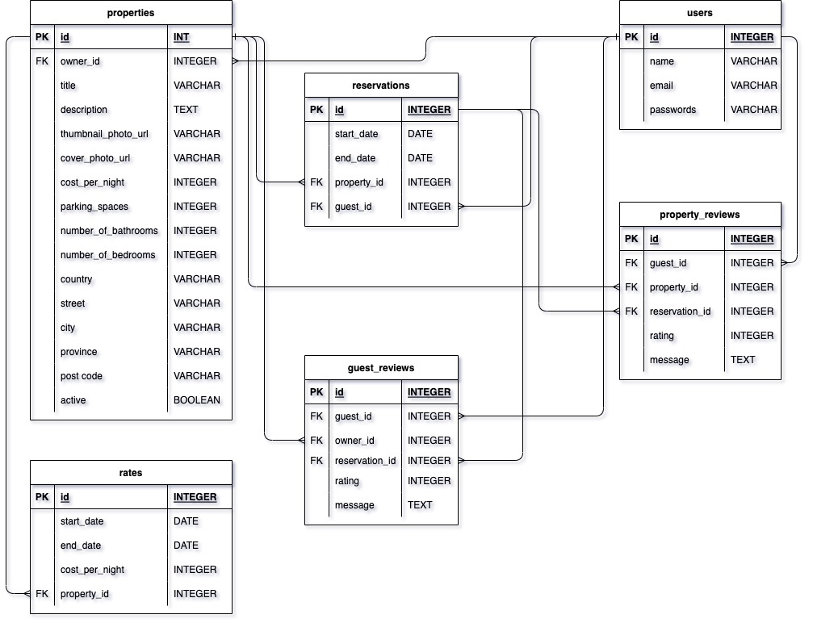

# LightBnB

## Project Structure

```
├── public
│   ├── index.html
│   ├── javascript
│   │   ├── components 
│   │   │   ├── header.js
│   │   │   ├── login_form.js
│   │   │   ├── new_property_form.js
│   │   │   ├── property_listing.js
│   │   │   ├── property_listings.js
│   │   │   ├── search_form.js
│   │   │   └── signup_form.js
│   │   ├── index.js
│   │   ├── libraries
│   │   ├── network.js
│   │   └── views_manager.js
│   └── styles
├── sass
└── server
  ├── apiRoutes.js
  ├── database.js
  ├── json
  ├── server.js
  └── userRoutes.js
```

* `public` contains all of the HTML, CSS, and client side JavaScript. 
  * `index.html` is the entry point to the application. It's the only html page because this is a single page application.
  * `javascript` contains all of the client side javascript files.
    * `index.js` starts up the application by rendering the listings.
    * `network.js` manages all ajax requests to the server.
    * `views_manager.js` manages which components appear on screen.
    * `components` contains all of the individual html components. They are all created using jQuery.
* `sass` contains all of the sass files. 
* `server` contains all of the server side and database code.
  * `server.js` is the entry point to the application. This connects the routes to the database.
  * `apiRoutes.js` and `userRoutes.js` are responsible for any HTTP requests to `/users/something` or `/api/something`. 
  * `json` is a directory that contains a bunch of dummy data in `.json` files.
  * `database.js` is responsible for all queries to the database. It doesn't currently connect to any database, all it does is return data from `.json` files.

  #
A database application project developed as a part of _[Lighthouse Labs Web development](https://www.lighthouselabs.ca/web-bootcamp)_ course. The front-end is forked from [lighthouse-labs/LightBnB_WebApp](https://github.com/lighthouse-labs/LightBnB_WebApp)
Install the LightBnB_WebApp `npm install`, run it `npm run local`, and view it at `localhost:3000`.

## ERD 
### Info
- _`users`_
  - `id`: Primary Key
  - `name`
  - `email`
  - `password`
  
- _`properties`_
  - `id`: Primary Key+
  - `owner_id` : Foreign Key _`users(id)`_
  - `title`
  - `description`
  - `thumbnail_photo_url`
  - `cover_photo_url`  
  - `cost_per_night`
  - `parking_spaces`
  - `number_of_bathrooms`
  - `number_of_bedrooms`
  - `country`
  - `street`
  - `city`
  - `province`
  - `postal_code`
  - `active`

- _`reservations`_
  - `id`: Primary Key
  - `start_date`
  - `end_date`
  - `property_id` : Foreign Key _`properties(id)`_
  - `guset_id` : Foreign Key _`users_id(id)`_

- _`property_reviews`_
  - `id`: Primary Key
  - `guest_id` : Foreign Key _`users(id)`_
  - `property_id` : Foreign Key _`properties(id)`_
  - `reservation_id` : Foreign Key _`reservations(id)`_
  - `message`
  - `rating`

- _`rates`_
  - `id`: Primary Key
  - `start_date`
  - `end_date`
  - `cost_per_night`
  - `property_id` : Foreign Key _`properties(id)`_

### ERD DIAGRAM
  


## Migrations
### [schema.sql](migrations/01_schema.sql)
Creates database `lightbnb` and switches to it.

## Sample Queries
### [01_user_login.sql](queries/01_user_login.sql)
Selects _id, name, email & password_ of a given user; here 'tristanjacobs@gmail.com'.
```bash
 id |     name      |          email          |   password
----+---------------+-------------------------+--------------
  1 | Devin Sanders | tristanjacobs@gmail.com |  $2a$10$FB...
(1 row)
```

averageLengthOfReservations
### [02_avg_length_reservation.sql](1_queries/02_avg_length_reservation.sql)
Selects the average duration of all reservations.
```bash
  average_duration   
---------------------
 14.6636000000000000
(1 row)
```

### [03_property_listing_by_city.sql](1_queries/03_property_listing_by_city.sql)
Shows all details about properties located in Vancouver including their average rating.


```bash
 id  |       title        | cost_per_night |   average_rating   
-----+--------------------+----------------+--------------------
 224 | Nature bite        |          10526 | 4.1000000000000000
 197 | Build they         |          34822 | 4.1000000000000000
  47 | Aside age          |          35421 | 4.2500000000000000
 149 | Present television |          53062 | 4.2222222222222222
(4 rows)
```
